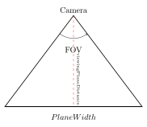
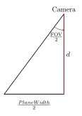

So I initially create a camera, simply defining its position at the origin. FOV will be 90°, while the distance between the camera and the viewing plane will be 1 unit.

```c++
//set up the camera and the view plane  
sf::Vector3f cameraPosition = {0,0,0};  
const float viewingPlaneDistance = 1.0f; //the distance between the camera and the center of the viewing plane  
const float fovDegrees = 90.f;  
float aspectRatio = static_cast<float>(screenWidth)/screenHeight;
```

Let us now try to define our plane width. Since we are given our FOV and the viewing plane distance (which for the sake of these diagrams and my time, I will use the variable $d$),  we could use some simple trigonometry to find the PlaneWidth. 
<div align="center">  
 
</div>

Lets split it into 2 triangles.

<div align="center">  
 
</div>

And so thus:

$$
\tan{\frac{FOV}{2}} = \frac{\frac{PlaneWidth}{2}}{d} = \frac{PlaneWidth}{2d}
\newline
$$
Rearranging for PlaneWidth gets us:

$$
PlaneWidth = 2\cdot d\cdot \tan{\frac{FOV}{2}}
$$
And since we also already know our aspect ration, and we know that our screen's aspect ration should also be the same as the viewing plane's: 

```c++
float viewPlaneWidth = 2 * viewingPlaneDistance * std::tan(fovDegrees/2);  
float viewPlaneHeight = viewPlaneWidth/aspectRatio;
```

Lets now define Vector3f variables for our plane's dimensions. In SFML, our starting location is in the top left corner, so lets also get that position translated into our viewing plane.

```c++
//distance from left to right, up to down, of each view plane as vec3f  
sf::Vector3f planeRight = {viewPlaneWidth,0,0};  
sf::Vector3f planeUp = {0,viewPlaneHeight,0};  
  
//get the position of the top left corner in coordinate space
sf::Vector3f topLeftCorner = cameraPosition + sf::Vector3f{  
    -viewPlaneWidth/2,  
    viewPlaneHeight/2,  
    -viewPlaneWidth};
```

So now let's get the pixel step in x, and pixel step in y. This means the distance, in coordinate points, between to "pixels" on the viewing plane. So we have multiple pixels on that screen, and they are right next to each other, but we want the distance between each pixel in that coordinate world on that view plane.

```c++
//pixel steps  
sf::Vector3f pixelStepX = planeRight/static_cast<float>(screenWidth);  
sf::Vector3f pixelStepY = planeUp/static_cast<float>(screenHeight);
```

Now the majority of our variables seem to be set up for the Viewing plane. Now we an finally move on to [Ray-Sphere Intersection](Ray-Sphere%20Intersection.md).