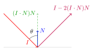
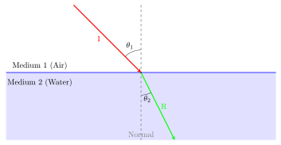

To implement materials, we are going to make an abstract class for different material types. A material just needs to tell us whether or not the incoming ray is to be scattered (and how it should be), or whether it is absorbed.

We add `std::shared_ptr<material> mat` to our `hit_record`, allowing an intersection to reference the material that was hit without copying the material itself. Multiple objects can share the same material instance, and every intersection can simply point to that shared material. Using `shared_ptr` also enables polymorphism, allowing different material types to be accessed through a common `material` interface while automatically managing the material's lifetime. The `hit_record` usually doesn't _own_ the material conceptually. It's just remembering which material was hit.

## Lambertian Reflection

For matte objects with perfect, Lambertian diffusion, through the use of Lambert's Cosine Law, we have the class:

```cpp
class lambertian : public material {  
public:  
    lambertian(const sf::Vector3f& albedo) : albedo(albedo) {}  
  
    bool scatter(const ray &r_in, const hit_record &rec, sf::Vector3f attenuation, ray &scattered) const override {  
        sf::Vector3f scatter_direction = rec.normal + randomUnitVector(); //lambertian distribution  
        scattered = ray(rec.p, scatter_direction);  
  
        if (nearZero(scatter_direction)) scatter_direction = rec.normal;  
  
        attenuation = albedo; //if you want attenuation some of the time, you could do albedo/p, where p is a constant. currently we have no attenuation  
        return true;  
    }  
private:  
    sf::Vector3f albedo;  
};
```

Lambert's Cosine Law is defined to give a distribution of light as such:

As $\theta$ increases, $\cos{\theta}$ approaches 0. The light's intensity, represented by $r_i$ would be strongest if it is facing the surface directly (i.e. $\theta=0$). What our code does (`sf::Vector3f scatter_direction = rec.normal + randomUnitVector();`), is an approximation of that. Its quicker and still gives a good-enough approximation.

## Mirrored Reflections *(Metal)*
<div align="center">  
 
</div>
Incident ray $\mathbf{I}$ strikes the surface to be reflected perfectly. The reflecting ray we can get with the projection of $\mathbf{I}$ on to normal $\mathbf{N}$, is of length $\mathbf{I} \cdot \mathbf{N}$, and we scale it by $\mathbf{N}$ to give it its direction. So far we have $(\mathbf{I} \cdot \mathbf{N})\mathbf{N}$. We thus now have the perpendicular component of $\mathbf{I}$ aligned at $\mathbf{N}$. The parallel , which, through substitution, is given by:
$$
\mathbf{I} = \mathbf{I}_\perp +\mathbf{I}_\parallel
$$
$$
\mathbf{I}_\parallel=\mathbf{I}-\mathbf{I}_\perp
$$
Our reflected ray will have the same $I_\parallel$, but a reflected $I_\perp$. Thus
$$
\mathbf{R}=\mathbf{I}_\parallel - \mathbf{I}_\perp
$$
$$
\mathbf{R}= \mathbf{I}-(\mathbf{I} \cdot \mathbf{N})\mathbf{N} - ((\mathbf{I} \cdot \mathbf{N})\mathbf{N})
$$
$$
\mathbf{R}=\mathbf{I}-2(\mathbf{I} \cdot \mathbf{N})\mathbf{N}
$$
We can write this into code as:
```cpp
inline sf::Vector3f reflect(const sf::Vector3f& incident, const sf::Vector3f& normal) {  
    return incident - 2.0f * incident.dot(normal) * normal;  
}
```
### Fuzzed Reflections
To make a fuzzy reflection, we just make a random point along a sphere for the reflecting ray to be in.

For fuzzier reflections, we will just adjust the radius of this "fuzz sphere" to allow for a wider range of randomness for the reflected ray.

## Refraction *(Dielectric Materials)*


<div align="center">  
 
</div>

Refraction is defined by Snell's Law:
$$
\eta_1 \sin\theta_1 = \eta_2 \sin{\theta_2}
$$
Where $\eta_1$ and $\eta_2$ are the refractive indices of the mediums. Where $\mathbf{N}^\prime$ is the normal side where the angle $\theta_2$ is formed between $\mathbf{N}^\prime$ and $\mathbf{R}$, $\mathbf{R}$ can be split into components perpendicular and parallel to the $\mathbf{N}^\prime$.
$$
\mathbf{R} = \mathbf{R}_\parallel + \mathbf{R}_\perp
$$
Solving for $R_\perp$ and $R_\parallel$, we get
$$
\mathbf{R}_\parallel=-\sqrt{1-||\mathbf{R}_\perp||^2 }\mathbf{N}^\prime
$$
$$
\mathbf{R}_\perp = \frac{\eta_1}{\eta_2} (\mathbf{I}+||\mathbf{I}\|cos(\theta)\mathbf{N}^\prime)
$$
This is given from *Ray Tracing in One Weekend* and we accept it as fact. You can prove it, but its proof is not necessary. The only value we do not know is $cos\theta$. We can utilize the definition of a dot product to put it in terms of values we do know. Since the dot product is defined to be
$$
\mathbf{a} \cdot \mathbf{b} = \|\mathbf{a}\| \|\mathbf{b}\| \cos \theta
$$
and assuming that both $\mathbf{a}$ and $\mathbf{b}$ are unit vectors, we get:
$$
\mathbf{a} \cdot \mathbf{b} =\cos \theta
$$
We can define $\mathbf{R_\perp}$ to be:
$$\mathbf{R}_\perp = \frac{\eta_1}{\eta_2} (\mathbf{I}+(-\mathbf{I}\cdot\mathbf{N}^\prime)\mathbf{N}^\prime$$
We can write this into code as:
```cpp
/// @param relativeRefractiveIndex The relative refractive index, equal to Eta initial divided by Eta final  
inline sf::Vector3f refract(const sf::Vector3f& incident, const sf::Vector3f& normal, float relativeRefractiveIndex) {  
    float cosTheta = std::fmin(normal.dot(-incident), 1.0);  
    sf::Vector3f refractPerp = relativeRefractiveIndex * (incident + cosTheta * normal);  
    sf::Vector3f refractParallel = static_cast<float>(-std::sqrt(std::fabs(1.0-refractPerp.lengthSquared()))) * normal;  
    return refractPerp + refractParallel;  
}
```

### Schlick Approximation
When you look at a transparent surface from a specific angle, it behaves like a mirror and reflects. There is an equation for that, but instead its much more popular to use the Schlick Approximation for that.


The next thing we want now is some optimization, which we can implement through the use of [Bounding Volume Hierarchies](Bounding%20Volume%20Hierarchies.md).